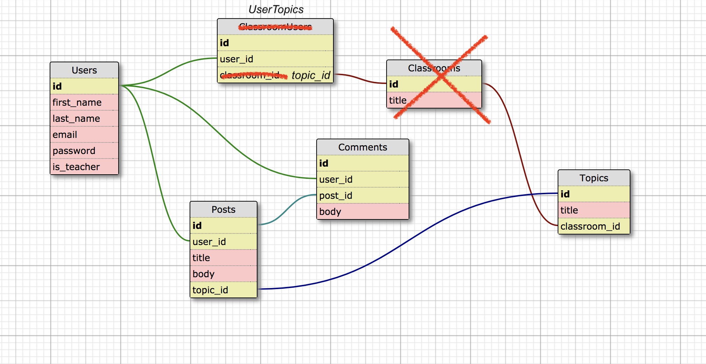

# Collective

## Purpose

This app would be designed to allow students to post ideas about topics being explored in class in one location. This would allow students in a class to post their helpful ideas for other students to see and reference so everyone can document their learning together.

Posts would be persisted for a topic and stored for future viewing. Every post can receive positive feedback and can be commented on. A certain number of votes for a topic would contribute to achievements for a user.

Teachers setup classes and students can add themselves. Teachers can also add ideas and topic posts, just like students.

### Students

- Students sign up for a profile.
- Students can join classes by invitation from their teacher.
- Students are able to post any topic in a class.
- Teachers can create topics, students can suggest topics to be created.
- Students can gain achievement badges based on upvotes.
- Students can upvote other students' submissions

### Teachers
- Teachers sign up for a profile.
- Teachers can set classes.
- Teachers can open topics for discussion.
- Teachers can post in any of their classes' topics.
- Teachers can remove students from a class.
- Teachers can add a level of verification/certification to a post, highlighting it.

### Posts
- Posts belong to a topic in a class and also to the user that posted them.
- Posts can be commented on (thread stlye)
- Posts can be created by students and teachers.
- Posts can be udpated by the student that created them.
- Posts can be viewed by any user; they don't have to be in a classroom.
- Posts can be removed by the user that created them and by any teacher of that classroom.

### Comments
- Comments can be added to any post.
- Comments should be short text to encourage new ideas to be new posts.
- Comments can be created by any student or teacher of a classroom on any post.
- Comments can also be viewed by anyone, even outside of the classroom.
- Comments can be updated by the student/teacher that added it.
- Comments can be deleted by the student that created it or by a teacher.

### Schema Design

